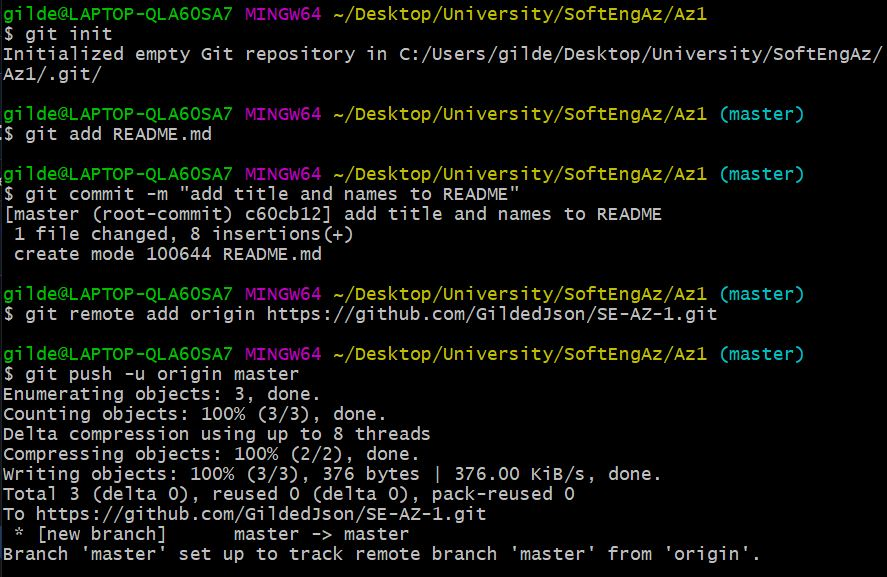
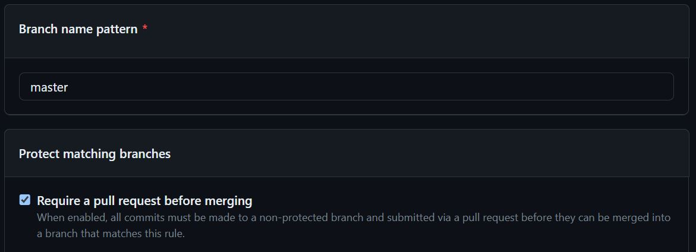

# آزمایش اول آز مهندسی نرم‌افزار

## سیدمحمدصادق طبائیان - 98105868

## عبدالصمد حقیری - 98105727

مراحل ساخت مخزن و اولین کامیت‌ها در شکل زیر قابل مشاهده است.

ایجاد قانون جلوگیری از کامیت مستقیم به شاخه‌ی اصلی به شکل زیر است. (البته این قانون تا زمان ایجاد شاخه‌ها تنظیم نشد.)

پرسش 1:

پرسش 2:

پرسش 3:

